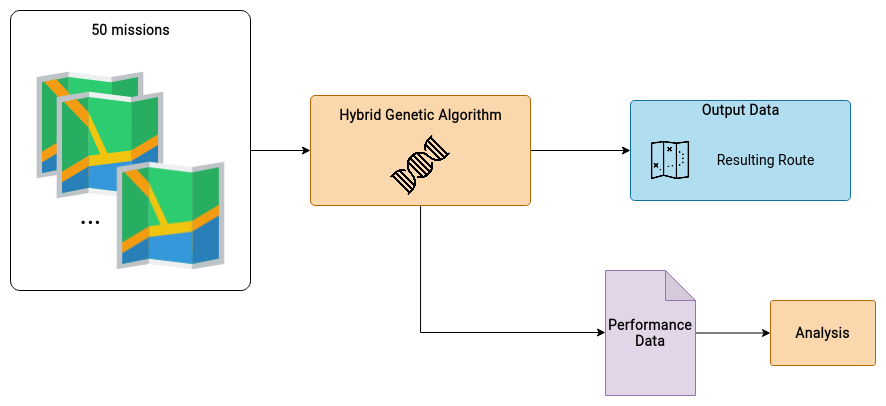

# Genetic Algorithm Applied in UAV's Path Planning

This research started as the conclusion work of my bachelor's degree in Information Systems at the University of Sao Paulo - USP. The research continued and led to the publication of a paper entitled "Genetic Algorithm Applied in UAV's Path Planning" published at the IEEE Congress on Evolutionary Computation (CEC). As an effort to make all the work reproducible, I took a course at the State University of Campinas (Unicamp) for my (current) Master's studies and updated and enhanced this repository.

## ABSTRACT

The present paper introduces a hybrid genetic algorithm for path planning problem with obstacle avoidance. The genetic algorithm is combined with Ray Casting (RC) algorithm, where  RC  is  responsible  to  avoid  obstacles  and  to  find  safe regions  for  emergency  landing.  Thus,  the  path  planning  system must  deal  with  a  non-convex  environment  when  planning  and replanning  trajectories.  The  system  must  also  work  embedded on  the  UAV  running  under  a  Raspberry  Pi  board.  The  hybrid method  is  evaluated  over  50  benchmark  maps  from  literature with  satisfactory  results  reported.

**INDEX TERMS** — hybrid  method,  ray  casting,  genetic  algorithm,path  planning,  UAV,  emergency  landing

## Table of Contents <!-- omit in toc -->

- [Genetic Algorithm Applied in UAV's Path Planning](#genetic-algorithm-applied-in-uavs-path-planning)
  - [ABSTRACT](#abstract)
  - [Publications](#publications)
    - [Cite](#cite)
  - [Repository Organization](#repository-organization)
  - [Workflow](#workflow)
  - [Dependencies](#dependencies)
    - [Related Dependencies](#related-dependencies)
  - [Executing the Paper](#executing-the-paper)
    - [Building](#building)
      - [Build Using Makefile (recommended)](#build-using-makefile-recommended)
      - [Build Using Bash](#build-using-bash)
    - [Running](#running)
      - [Run Using Makefile (recommended)](#run-using-makefile-recommended)

## Publications

As a product of this research you can find publications relating this topic:

- [(PDF)](./reports/Genetic%20Algorithm%20Applied%20in%20UAV's%20Path%20Planning.pdf) Genetic Algorithm for UAV's Path Planning - published at IEEE CEC 2020
- [(Reproducible Paper)](./reports/Paper%20-%20Genetic%20Algorithm%20Applied%20in%20UAV's%20Path%20Planning.ipynb) Genetic Algorithm for UAV's Path Planning - Jupyter Notebook for Reproducibility
- [(PDF)](http://bdta.sibi.usp.br/directbitstream/46bcc039-bf3c-47a3-960e-87530cf1944d/gustavo%20de%20moura%20souza.pdf) Genetic Algorithm for UAV's Path Planning - Undergrad Monograph

### Cite

To cite this work, use the following Bibtex:

```bibtex
@INPROCEEDINGS{demoura2020,
  author={G. {de Moura Souza} and C. F. M. {Toledo}},
  booktitle={2020 IEEE Congress on Evolutionary Computation (CEC)}, 
  title={Genetic Algorithm Applied in UAV’s Path Planning}, 
  year={2020},
  volume={},
  number={},
  pages={1-8},
  doi={10.1109/CEC48606.2020.9185909}
}
```

## Repository Organization

This repository is organized as follows:

- [`data`](./data) contains all the data used in this work, it is mostly maps and configurations
- [`design`](./design) contains auxiliary files to understand the design of the proposed system
- [`experiments`](./experiments) contains the files for experiments
- [`reports`](./reports) contains textual files that further explain this work (The paper is here!)
- [`src`](./src) contains all the source files
- [`test`](./test) contains testing files to assure everything is working

## Workflow

The path planning algorithm developed, called "Hybrid Genetic Algorithm" receives as input a mission object. The mission is composed of a map definition, an origin waypoint and a destination waypoint. The map contains obstacles, no-fly zones and bonus zones. As output, the algorithm projects the optimal route avoiding obstacles. The image belows instates the workflow of the algorithm.


To test the performance of the proposed algorithm, the HGA is run over 50 different complex missions from literature. As a result, the algorithm will provide the best routes, as well as the time each route is produced. An analysis over these results will test each map to see its feasibility and generate a couple of reports. The image belows instates the workflow for the experiments run.



The codes used to produce the HGA is at the [genetic file](./src/naboo/genetic.py). The codes used to run the test and the analysis is at the [reproducible paper](./reports/Paper%20-%20Genetic%20Algorithm%20Applied%20in%20UAV's%20Path%20Planning.ipynb).

## Dependencies

For the code to work, you need to have the following:

- Ubuntu Operational System. (This work was done and tested on Ubuntu SO, althought there are indications that, by using Docker, you can run in other SOs, no tests were made to guarantee that.)
- The platform [Docker](https://docs.docker.com/get-docker/) installed;
- The image `path-planning-hga`; (check how to build it [here](#building-the-image))

### Related Dependencies

Although this work was developed in such a way that it is not necessary to install specific dependencies related to the codes, the full list of requirements for the code to compile is listed [here](./src/requirements.txt) in case you want to run without using Docker. We stress that the best way to run this work is using Docker.

## Executing the Paper

First of all, clone this repository into your machine. Once the repository is cloned, there are a few ways you can execute this work.

The first thing you need to do, is to build the image. Check out how [here](#building).

Then you need to compile and run the system to make the Jupyter Notebook available. Check out how [here](#running).

Having all the setup ready, simply open the [Reproducible Paper](./reports/Paper%20-%20Genetic%20Algorithm%20Applied%20in%20UAV's%20Path%20Planning.ipynb) on your browser and run all cells.

### Building

You can build the docker image for this work in two manners: (1) using the Makefile target or (2) running the commands by yourself.

#### Build Using Makefile (recommended)

This is the easiest way of building the image. This Makefile was prepared so you don't need to worry. Simply run this command on your bash terminal from the root folder of this repository:

```bash
make build
```

#### Build Using Bash

If you want to, you can compile the code and build the image yourself by running this command on your bash terminal from the root folder of this repository:

```bash
sed \
    -e 's|{NAME}|$IMAGE_NAME|g' \
    -e 's|{VERSION}|$TAG|g' \
    Dockerfile \
    | docker build -t $IMAGE_NAME:$TAG $DIRECTORY_PATH
```

where:

> `IMAGE_NAME`: the name given to the image built. We strongly recommend using `path-planning-hga`.
>
> `TAG`: the tag used to generate the image, and further to run the container. _eg: `latest`_.
>
> `DIRECTORY_PATH`: the directory where the Dockerfile of this repository is at. It needs to be the _absolute_ path. _eg: `/home/path-planning/`_.

Example:

```bash
sed \
    -e 's|{NAME}|path-planning-hga|g' \
    -e 's|{VERSION}|latest|g' \
Dockerfile \
    | docker build -t path-planning-hga:latest /home/path-planning/
```

### Running

#### Run Using Makefile (recommended)

This is the easiest way of executing the paper. This Makefile was prepared so you don't need to worry. You do not need to build the image if using this method, this make command will build the image for you. Simply run this command on your bash terminal from the root folder of this repository:

```bash
make open-paper
```

Sometimes it is necessary to run in `sudo` mode, since the command establishes a connection between your system's network ports, and that usually requires privileges.
