# Experimentos realizados

O simbolo `# !` informa quais parâmetros foram alterados de uma versão para outra

Fitness_trace:
fit_d fit_obs fit_con fit_cur fit_t fit_dist fit_z_bonus

## Mode A

Parâmetros utilizados:

```python
    par_RC = {
        'taxa_cross': 5,
        'population_size': 10,
        'max_exec_time': 180,
        'C_d': 10000,
        'C_obs': 10000,
        'C_con': 500,
        'C_cur': 100,
        'C_t': 100,
        'C_dist': 1,
        'v_min': 11.1,
        'v_max': 30.5,
        'e_min': -3,
        'e_max': 3,
        'a_min': -2.0,
        'a_max': 2.0,
        'T_min': 1,
        'T_max': 25,
        'mutation_prob': 0.7,
        'gps_imprecision': 1,
    }
```

### Results

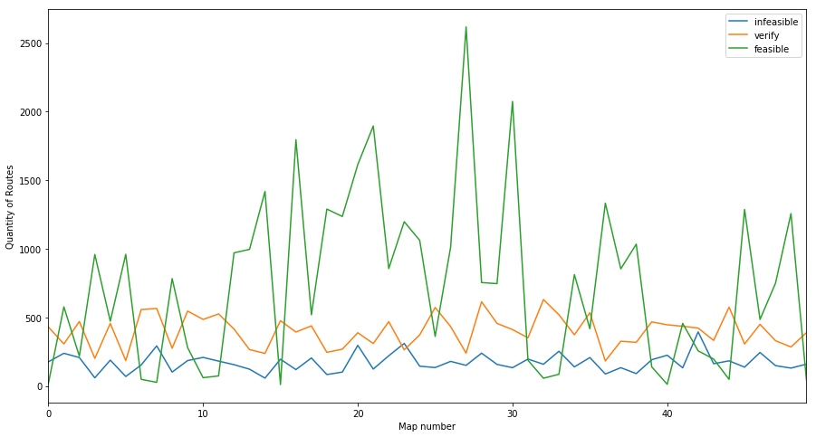

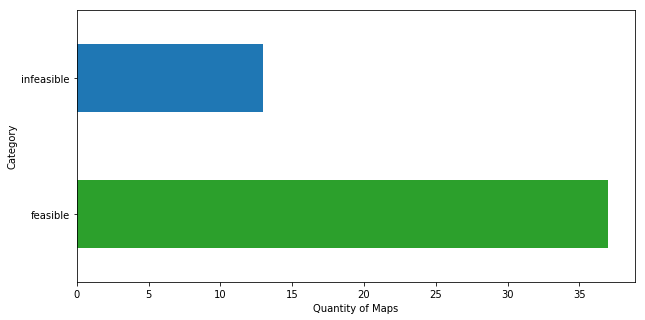

## Mode B

Parâmetros utilizados:

```python
    par_RC = {
        'taxa_cross': 5,
        'population_size': 10,
        'max_exec_time': 180,
        'C_d': 10000,
        'C_obs': 10000,
        'C_con': 500,
        'C_cur': 100,
        'C_t': 100,
        'C_dist': 1,
        'v_min': -3.0,         # !
        'v_max': 3.0,          # !
        'e_min': -3,
        'e_max': 3,
        'a_min': -2.0,
        'a_max': 2.0,
        'T_min': 1,
        'T_max': 25,
        'mutation_prob': 0.7,
        'gps_imprecision': 1,
    }
```

### Results


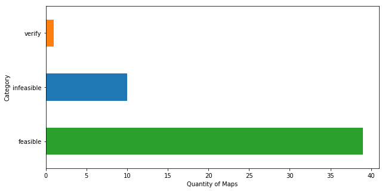

## Mode C

Parâmetros utilizados:

```python
par_RC = {
    'taxa_cross': 5,
    'population_size': 10,
    'max_exec_time': 180,
    'C_d': 100,            # !
    'C_obs': 1000,         # !
    'C_con': 0,            # !
    'C_cur': 0,            # !
    'C_t': 10,             # !
    'C_dist': 1,
    'v_min': -3.0,
    'v_max': 3.0,
    'e_min': -3,
    'e_max': 3,
    'a_min': -2.0,
    'a_max': 2.0,
    'T_min': 1,
    'T_max': 25,
    'mutation_prob': 0.7,
    'gps_imprecision': 1,
}
```

### Results

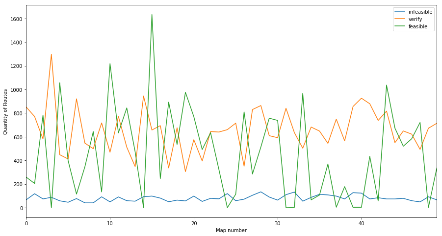

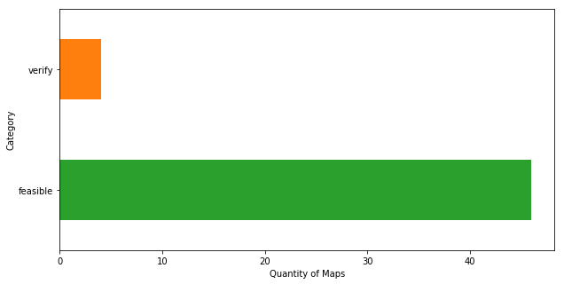

## Mode D

Parâmetros utilizados:

```python
par_RC = {
    'taxa_cross': 5,
    'population_size': 10,
    'max_exec_time': 60, # !
    'C_d': 100,
    'C_obs': 1000,
    'C_con': 0,
    'C_cur': 0,
    'C_t': 10,
    'C_dist': 1,
    'v_min': -3.0,
    'v_max': 3.0,
    'e_min': -3,
    'e_max': 3,
    'a_min': -2.0,
    'a_max': 2.0,
    'T_min': 1,
    'T_max': 25,
    'mutation_prob': 0.7,
    'gps_imprecision': 1,
}
```

### Results

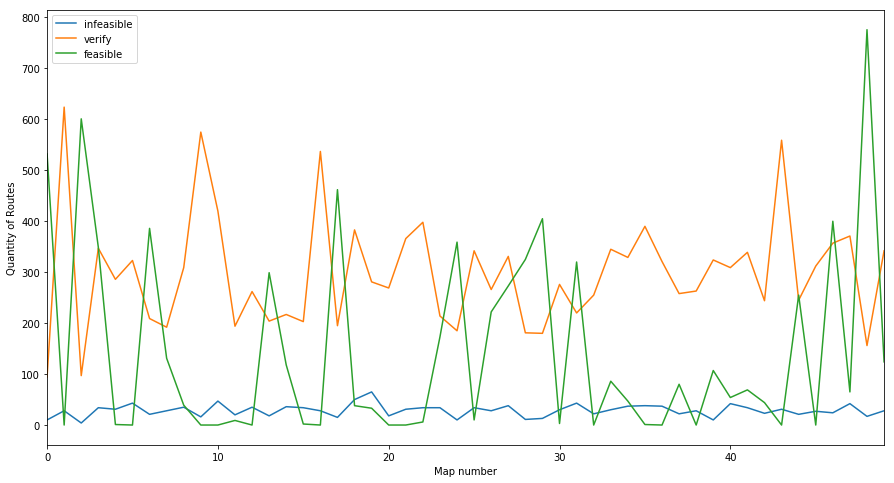

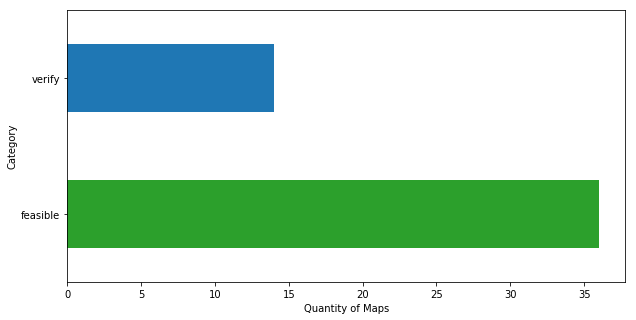

## Mode E

Parâmetros utilizados:

```python
par_RC = {
    'taxa_cross': 5,
    'population_size': 10,
    'max_exec_time': 10, # !
    'C_d': 100,
    'C_obs': 1000,
    'C_con': 0,
    'C_cur': 0,
    'C_t': 10,
    'C_dist': 1,
    'v_min': -3.0,
    'v_max': 3.0,
    'e_min': -3,
    'e_max': 3,
    'a_min': -2.0,
    'a_max': 2.0,
    'T_min': 1,
    'T_max': 25,
    'mutation_prob': 0.7,
    'gps_imprecision': 1,
}
```

### Results

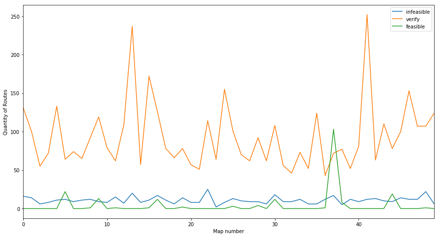

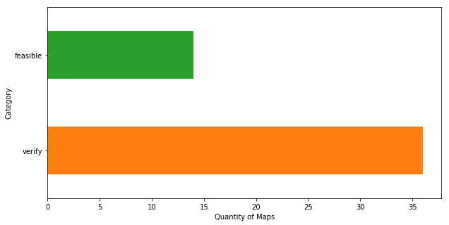

## Mode F

**ALTERAÇÕES**
Fitness_trace agora armazena somente o valor do fitness, sem a multiplicação pelo custo

Parâmetros utilizados:

```python
par_RC = {
    'taxa_cross': 5,
    'population_size': 10,
    'max_exec_time': 10,
    'C_d': 100,
    'C_obs': 1000,
    'C_con': 0,
    'C_cur': 0,
    'C_t': 10,
    'C_dist': 1,
    'v_min': -3.0,
    'v_max': 3.0,
    'e_min': -3,
    'e_max': 3,
    'a_min': -2.0,
    'a_max': 2.0,
    'T_min': 1,
    'T_max': 25,
    'mutation_prob': 0.7,
    'gps_imprecision': 1,
}
```

### Results

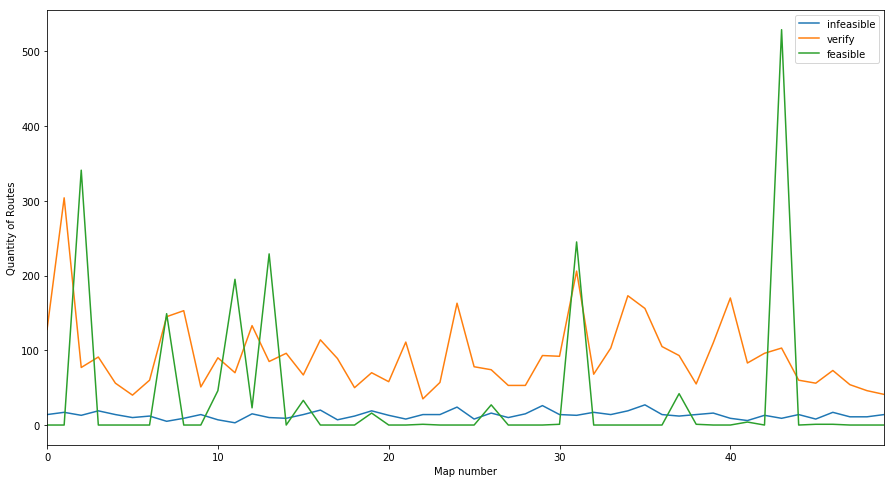

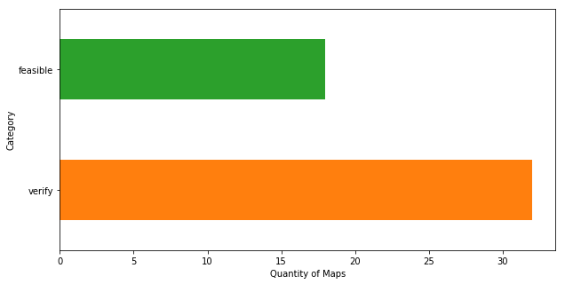

## Mode G

Parâmetros utilizados:

```python
par_RC = {
    'taxa_cross': 5,
    'population_size': 10,
    'max_exec_time': 180,  # !
    'C_d': 100,
    'C_obs': 1000,
    'C_con': 0,
    'C_cur': 0,
    'C_t': 10,
    'C_dist': 1,
    'v_min': -3.0,
    'v_max': 3.0,
    'e_min': -3,
    'e_max': 3,
    'a_min': -2.0,
    'a_max': 2.0,
    'T_min': 1,
    'T_max': 25,
    'mutation_prob': 0.7,
    'gps_imprecision': 1,
}
```

### Results

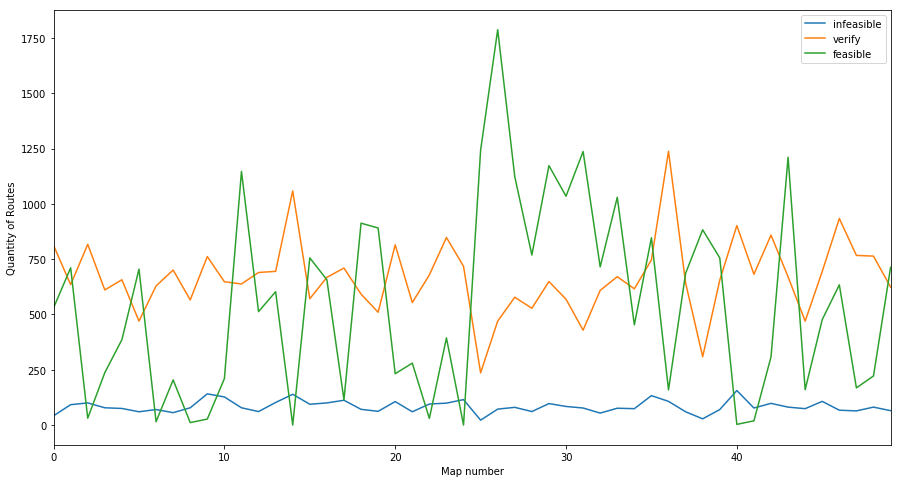

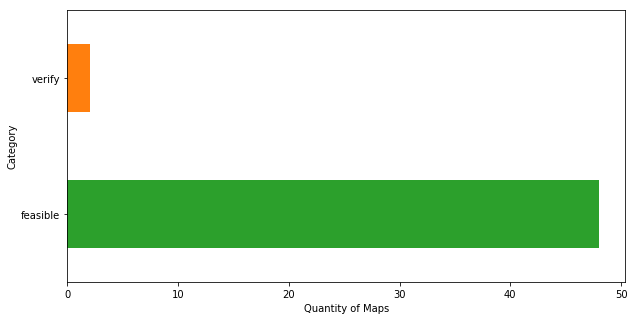


## Mode EMA 1,2

com função fitness de zona bonificadora.
1 - função que considera todos os pontos
2 e adiante - função que considera somente o ultimo ponto da rota

```python
par_RC = {
        'taxa_cross': 5,
        'population_size': 10,
        'max_exec_time': 180,
        'C_d': 0,
        'C_obs': 10000,
        'C_con': 500,
        'C_cur': 100,
        'C_t': 100,
        'C_dist': 1,
        'C_z_bonus': -1000,
        'v_min': -3.0,
        'v_max': 3.0,
        'e_min': -3,
        'e_max': 3,
        'a_min': -2.0,
        'a_max': 2.0,
        'T_min': 1,
        'T_max': 25,
        'mutation_prob': 0.7,
        'gps_imprecision': 1,
        'planning_mode': 'emergency',
    }
```

## Mode EMA 3, 4

```python
    par_RC = {
        'taxa_cross': 5,
        'population_size': 10,
        'max_exec_time': 180,
        'C_d': 0,
        'C_obs': 10000,
        'C_con': 10,
        'C_cur': 10,
        'C_t': 10,
        'C_dist': 1,
        'C_z_bonus': -10000,
        'v_min': -3.0,
        'v_max': 3.0,
        'e_min': -3,
        'e_max': 3,
        'a_min': -2.0,
        'a_max': 2.0,
        'T_min': 1,
        'T_max': 25,
        'mutation_prob': 0.7,
        'gps_imprecision': 1,
        'planning_mode': 'emergency',
    }
```

# TODO

## Mode R-PC

Versão optimized
Rodando no Computador

```python
par_RC = {
    "max_exec_time": 180,
    "C_d": 1000,
    "C_obs": 4000,
    "C_con": 0,
    "C_cur": 0,
    "C_t": 0,
    "v_min": -3.0,
    "v_max": 3.0,
    "T_min": 5,
    "T_max": 20,
    "a_min": -1.0,
    "a_max": 1.0,
    "e_min": -3,
    "e_max": 3,
    "min_precision": 0.1,
    "gps_imprecision": 0,
    "population_size": 40,
    "taxa_cross": 2,
    "mutation_prob": 0.7,
}
```


