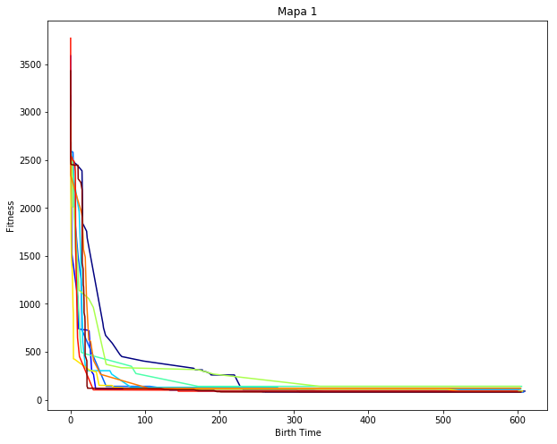
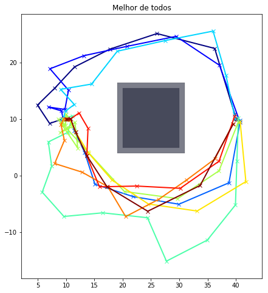
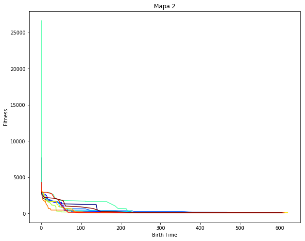
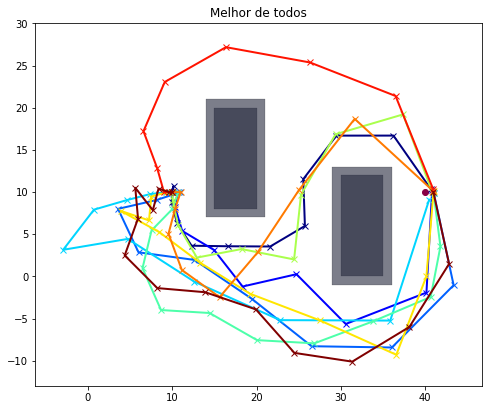
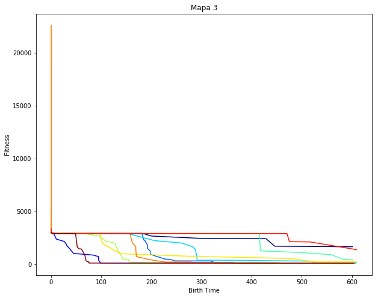
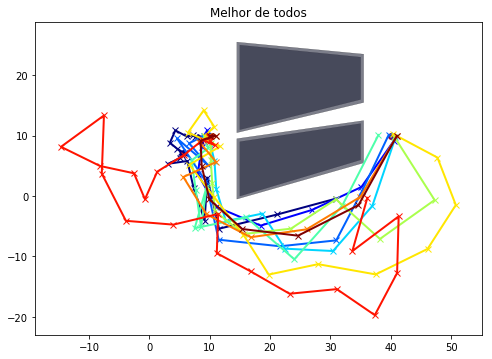
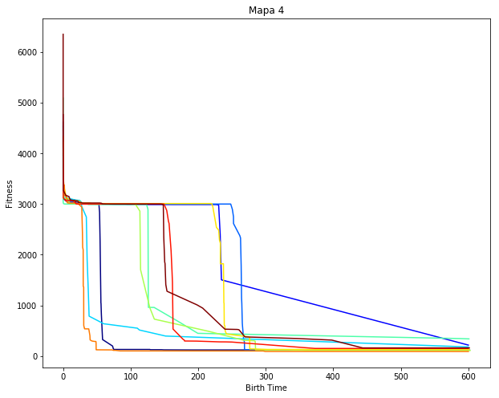
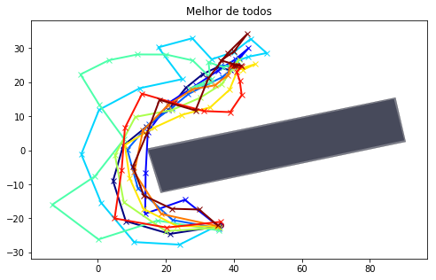

    Resultados da Alocação de Risco
    
     eixo x: tempo em que foi encontrada a melhor solução (em segundos)
     eixo y: fitness do melhor de todos
    --------------------------------------------------------------------------------

    --------------------------------------------------------------------------------

    --------------------------------------------------------------------------------

    --------------------------------------------------------------------------------

